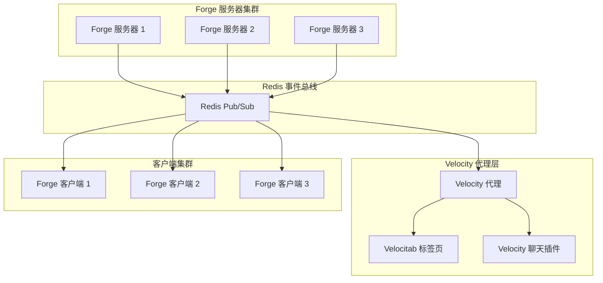
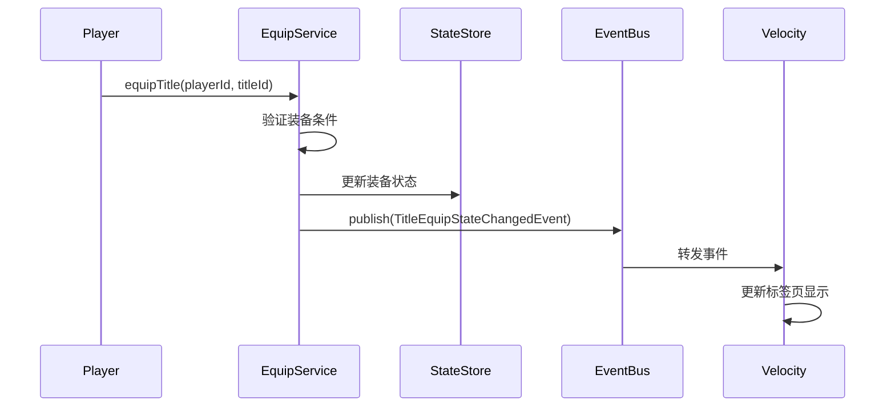
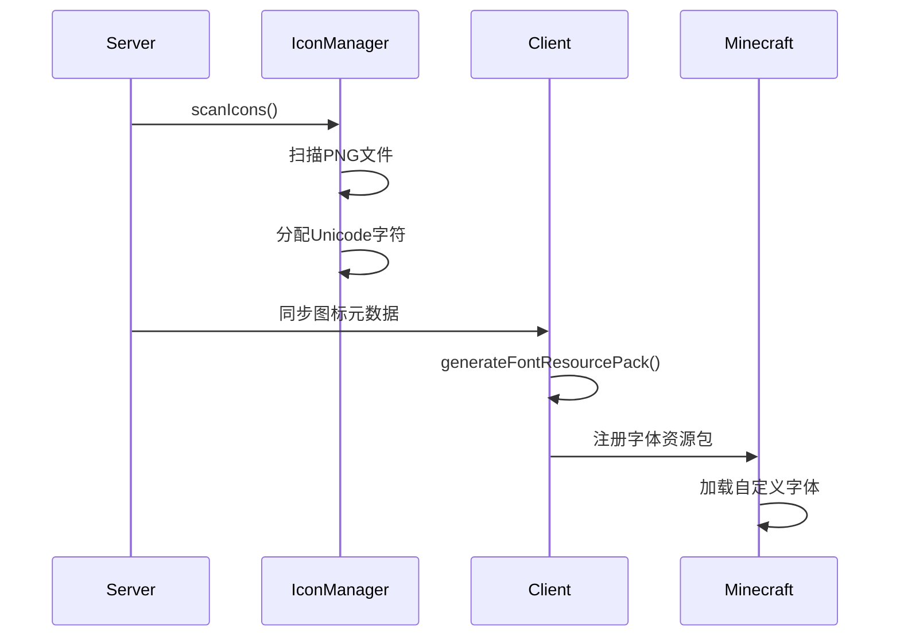
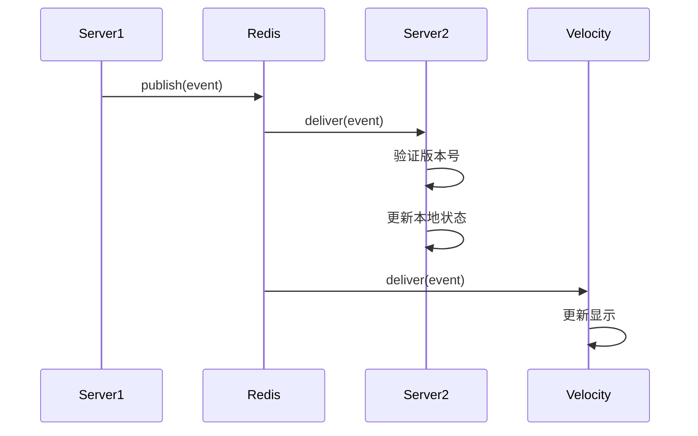

# 架构设计文档

## 📋 概述

Kavinshi PlayerTitle 系统是一个分布式跨服务器称号同步平台，采用事件驱动架构设计。本文档详细描述系统的整体架构、组件设计、数据流和技术选型。

## 🏗️ 系统架构总览

### 核心设计原则

1. **事件驱动**：所有跨服通信通过事件总线进行
2. **服务端权威**：Forge 服务器作为数据权威源
3. **客户端渲染**：客户端负责称号的最终渲染和显示
4. **配置驱动**：所有行为通过 JSON 配置文件定义
5. **松耦合**：组件之间通过接口和事件解耦

### 架构图



## 🔧 核心组件

### 1. 称号服务层

#### 1.1 TitleRegistry（称号注册表）
- **职责**：管理所有称号定义
- **特性**：
  - 加载和解析 JSON 配置文件
  - 提供称号查询和筛选接口
  - 支持称号分类和排序
- **关键接口**：
  ```java
  public interface TitleRegistry {
      List<TitleDefinition> getAllTitles();
      Optional<TitleDefinition> getTitleById(int id);
      List<TitleDefinition> getTitlesByCategory(String category);
      void reload();
  }
  ```

#### 1.2 TitleEquipService（称号装备服务）
- **职责**：处理玩家称号的装备和卸下
- **特性**：
  - 验证装备条件
  - 发布装备状态变更事件
  - 管理玩家当前装备的称号
- **关键接口**：
  ```java
  public class TitleEquipService {
      public EquipResult equipTitle(UUID playerId, int titleId);
      public EquipResult unequipTitle(UUID playerId);
      public Optional<Integer> getEquippedTitleId(UUID playerId);
  }
  ```

#### 1.3 TitleProgressService（称号进度服务）
- **职责**：跟踪和更新玩家称号解锁进度
- **特性**：
  - 处理进度更新事件
  - 检查称号解锁条件
  - 发布称号解锁事件
- **关键接口**：
  ```java
  public class TitleProgressService {
      public ProgressUpdateResult updateProgress(
          UUID playerId, 
          TitleConditionType conditionType, 
          int delta
      );
      public Map<Integer, Integer> getPlayerProgress(UUID playerId);
  }
  ```

### 2. 图标系统层

#### 2.1 IconManager（图标管理器）
- **职责**：扫描和管理 PNG 图标文件
- **特性**：
  - 自动扫描 `config/playertitle/icons/` 目录
  - 验证 PNG 文件尺寸（16×16 或 32×32）
  - 分配唯一的 PUA（Private Use Area）Unicode 字符
- **关键流程**：
  ```
  扫描目录 → 验证文件 → 分配 Unicode → 创建 IconDefinition → 缓存管理
  ```

#### 2.2 ClientIconManager（客户端图标管理器）
- **职责**：客户端字体资源包生成
- **特性**：
  - 生成 Minecraft 字体定义 JSON
  - 创建纹理图集
  - 打包字体资源包
- **关键流程**：
  ```
  获取图标定义 → 生成纹理 → 创建字体 JSON → 打包资源包 → 注册到游戏
  ```

#### 2.3 TitleIconResolver（称号图标解析器）
- **职责**：解析称号定义中的图标配置
- **特性**：
  - 根据图标 ID 查找对应的 Unicode 字符
  - 处理图标颜色配置
  - 生成最终的可渲染文本组件
- **关键接口**：
  ```java
  public class TitleIconResolver {
      public Component resolveIcon(TitleDefinition titleDefinition);
      public char getIconUnicodeChar(String iconId);
  }
  ```

### 3. 跨服同步层

#### 3.1 ClusterEventBus（集群事件总线）
- **职责**：跨服务器事件通信
- **实现**：
  - **LocalEventBus**：本地事件总线，用于单服务器环境
  - **RedisEventBus**：基于 Redis Pub/Sub 的分布式事件总线
- **关键接口**：
  ```java
  public interface ClusterEventBus {
      void start();
      void stop();
      void publish(ClusterSyncEvent event);
      void subscribe(Consumer<ClusterSyncEvent> handler);
      String getImplementationName();
  }
  ```

#### 3.2 ClusterRevisionService（集群版本服务）
- **职责**：确保事件顺序和幂等性
- **特性**：
  - 为每个玩家维护递增的版本号
  - 确保事件的顺序一致性
  - 防止重复事件处理
- **关键机制**：
  ```
  每个事件包含 {playerId, eventType, revision}
  接收端缓存处理过的最大版本号
  只处理 revision > cachedRevision 的事件
  ```

#### 3.3 TitleEventFactory（称号事件工厂）
- **职责**：创建各种称号相关事件
- **支持的事件类型**：
  - `TitleAssignedEvent`：称号解锁
  - `TitleRemovedEvent`：称号移除
  - `TitleEquipStateChangedEvent`：装备状态变更
  - `TitleProgressUpdatedEvent`：进度更新
  - `TitleUpdatedEvent`：称号定义更新

### 4. 玩家状态层

#### 4.1 PlayerTitleState（玩家称号状态）
- **职责**：维护玩家的称号状态
- **数据结构**：
  ```java
  public class PlayerTitleState {
      private UUID playerId;
      private Map<Integer, Integer> titleProgress; // titleId -> progress
      private Optional<Integer> equippedTitleId;
      private Instant lastUpdated;
  }
  ```

#### 4.2 PlayerTitleStateRepository（状态仓库）
- **职责**：持久化玩家称号状态
- **实现**：
  - **内存存储**：用于开发和测试
  - **数据库存储**：生产环境推荐使用 MySQL
- **关键接口**：
  ```java
  public interface PlayerTitleStateRepository {
      Optional<PlayerTitleState> findByPlayerId(UUID playerId);
      void save(PlayerTitleState state);
      void deleteByPlayerId(UUID playerId);
  }
  ```

#### 4.3 PlayerStateLifecycleHandler（状态生命周期处理器）
- **职责**：管理玩家状态的加载和保存
- **生命周期**：
  ```
  玩家加入 → 加载状态 → 缓存内存
  状态变更 → 更新缓存 → 异步保存
  玩家退出 → 保存状态 → 清理缓存
  ```

## 🔄 数据流

### 1. 称号装备流程



### 2. 图标加载流程



### 3. 跨服事件同步流程



## 💾 数据模型

### 1. 称号定义（TitleDefinition）

```java
public class TitleDefinition {
    private int id;                    // 称号ID
    private String name;              // 称号名称
    private int displayOrder;         // 显示顺序
    private int color;                // 称号颜色
    private List<TitleCondition> conditions; // 解锁条件
    private String category;          // 分类
    private String icon;              // 图标文件名
    private String iconColor;         // 图标颜色
    private TitleStyleMode styleMode; // 样式模式
    private List<String> baseColors;  // 基础颜色列表
    private TitleAnimationProfile animationProfile; // 动画配置
}
```

### 2. 图标定义（IconDefinition）

```java
public class IconDefinition {
    private String id;                // 图标ID（文件名不带扩展名）
    private String name;              // 显示名称
    private Path pngPath;             // PNG文件路径
    private char unicodeChar;         // 分配的Unicode字符
    private int width;                // 宽度
    private int height;               // 高度
    private int ascent;               // 上升高度
    private int descent;              // 下降高度
}
```

### 3. 集群事件（ClusterSyncEvent）

```java
public abstract class ClusterSyncEvent {
    private UUID playerId;            // 玩家UUID
    private ClusterEventType eventType; // 事件类型
    private long revision;            // 版本号
    private Instant timestamp;        // 时间戳
    private String serverId;          // 源服务器ID
    
    // 公共字段
    // 事件特定数据
}
```

## ⚙️ 配置管理

### 1. 配置文件结构

```
config/playertitle/
├── titles.json              # 称号定义
├── categories.json          # 称号分类
├── conditions.json          # 条件类型定义
├── icons/                   # PNG图标目录
│   ├── crown.png
│   ├── star.png
│   └── medal.png
└── resourcepack/           # 生成的资源包
    ├── assets/
    │   └── playertitle/
    │       ├── font/
    │       │   └── playertitle.json
    │       └── textures/
    │           └── icons.png
    └── pack.mcmeta
```

### 2. 配置文件示例

#### titles.json
```json
[
  {
    "id": 1,
    "name": "新手玩家",
    "displayOrder": 100,
    "color": "#55FF55",
    "conditions": [
      {
        "type": "PLAYER_LEVEL",
        "value": 5
      }
    ],
    "category": "新手",
    "icon": "crown.png",
    "iconColor": "#FFD700",
    "styleMode": "STATIC",
    "baseColors": ["#FF0000", "#00FF00", "#0000FF"],
    "animationProfile": {
      "type": "NONE",
      "speed": 1.0
    }
  }
]
```

## 🔐 安全考虑

### 1. 事件安全
- **版本验证**：防止重放攻击
- **服务器认证**：事件源服务器验证
- **数据完整性**：事件签名验证（可选）

### 2. 数据安全
- **玩家数据隔离**：确保玩家只能访问自己的数据
- **条件验证**：服务器端验证所有解锁条件
- **配置验证**：配置文件格式和内容验证

### 3. 网络安全
- **Redis 安全**：使用密码认证和 TLS
- **服务器通信**：内部网络隔离
- **速率限制**：防止事件洪水攻击

## 📈 扩展性设计

### 1. 水平扩展
- **Redis 集群**：支持多节点 Redis 集群
- **服务器无状态**：除缓存外，服务器基本无状态
- **负载均衡**：支持多 Forge 服务器负载均衡

### 2. 功能扩展
- **插件系统**：支持自定义条件类型
- **事件处理器**：可扩展的事件处理机制
- **渲染引擎**：支持自定义渲染逻辑

### 3. 存储扩展
- **多存储后端**：支持 MySQL、PostgreSQL、MongoDB
- **缓存策略**：可配置的缓存策略
- **数据迁移**：提供数据迁移工具

## 🔍 监控和日志

### 1. 监控指标
- **事件吞吐量**：每秒处理的事件数量
- **玩家状态缓存命中率**
- **Redis 连接状态**
- **图标加载时间**

### 2. 日志记录
- **事件日志**：所有跨服事件的详细日志
- **错误日志**：系统错误和异常
- **性能日志**：关键操作的性能指标
- **审计日志**：玩家操作记录

### 3. 健康检查
- **Redis 连接检查**
- **配置文件健康检查**
- **内存使用监控**
- **线程池状态监控**

## 🚀 部署架构

### 1. 开发环境
```
单个 Forge 服务器 + 本地 Redis + 单个客户端
```

### 2. 测试环境
```
2-3 个 Forge 服务器 + Redis 哨兵 + Velocity 代理
```

### 3. 生产环境
```
Forge 服务器集群 + Redis 集群 + Velocity 集群 + 监控系统
```

### 4. 云原生部署（可选）
```
Kubernetes 部署 + Redis Operator + 自动伸缩
```

## 📊 性能考虑

### 1. 缓存策略
- **玩家状态缓存**：内存缓存 + Redis 二级缓存
- **称号定义缓存**：配置文件内存缓存
- **图标元数据缓存**：客户端本地缓存

### 2. 事件优化
- **批量处理**：支持事件批量发布
- **压缩传输**：事件数据压缩
- **连接池**：Redis 连接池管理

### 3. 内存管理
- **对象池**：频繁创建的对象使用对象池
- **弱引用缓存**：使用弱引用防止内存泄漏
- **GC 调优**：针对游戏服务器优化 GC 参数

---

**文档版本**：1.0.0  
**最后更新**：2026-04-20  
**维护者**：架构设计团队